# Port Call Trends Monitor

This section examines how AIS-derived trade estimates have evolved in ports along the Red Sea given the conflict in the Middle East and the escalating attacks in the Red Sea.

## Data

We process daily estimated trade (imports and exports) since 2019 from the IMF's [PortWatch](https://portwatch.imf.org/) platform for e following ports: Aden, Al Ahmadi, Al Aqabah, Al Mukalla, As Suways, Djibouti, Duba. Duba Bulk Plant Tanker Terminal, El-Adabiya, Jiddah, Jiddah Oil, King Fahd Port, North Ain Sukhna Port, Rabigh, Safaga, and Yanbu. As of this date, the latest data point available is February 19th, 2024.

The location of these ports can be verified in the following [interactive map](https://datapartnership.org/red-sea-monitoring/notebooks/ports/red-sea-ports.html#map-of-ports) within the notebook.

Since the data is daily and there multiple days with no trade, we first resample the data to weekly sums. The following charts show the estimated trade volumes by port. The vertical dotted lines mark the beginning of key periods of interest highlighted by the team.
- Middle East conflict: **October 7th**
- Red Sea crisis: **November 17th**

### Weekly Trade Charts

#### Djibouti

````{tab-set}
``` {tab-item} Djibouti
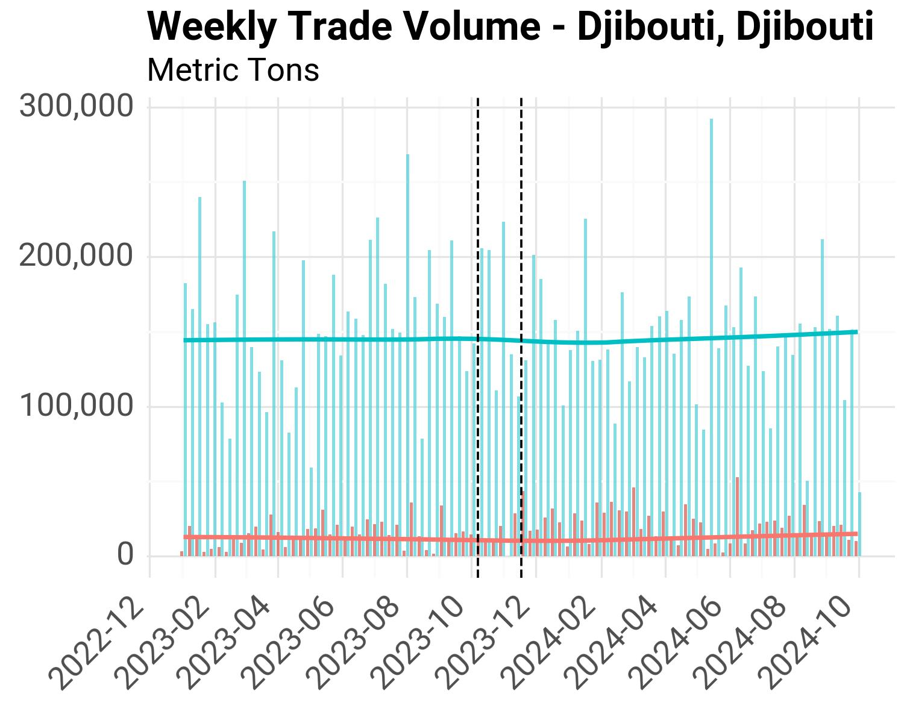
```
````

#### Egypt

````{tab-set}
``` {tab-item} El-Adabiya

```
``` {tab-item} Safaga
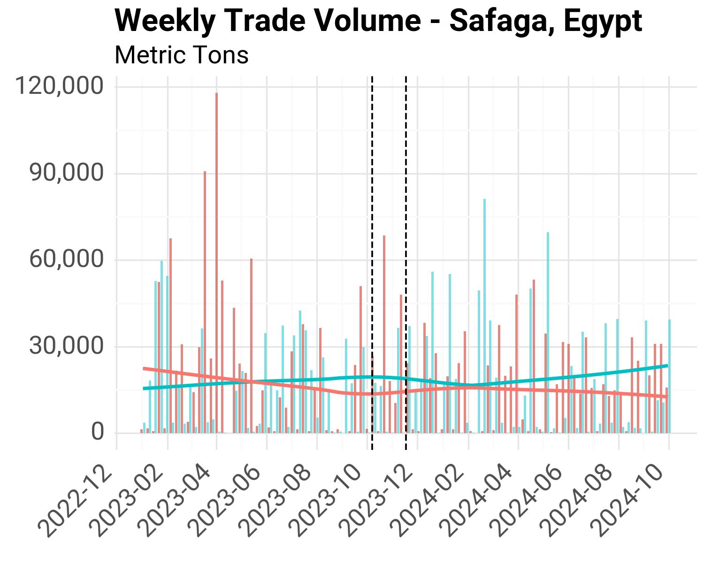
```
``` {tab-item} North Ain Sukhna Port

```
``` {tab-item} As Suways

```
````

#### Jordan

````{tab-set}
``` {tab-item} Al Aqabah

```
````

#### Saudi Arabia

````{tab-set}
``` {tab-item} Duba Bulk Plant Tanker Terminal

```
``` {tab-item} Rabigh
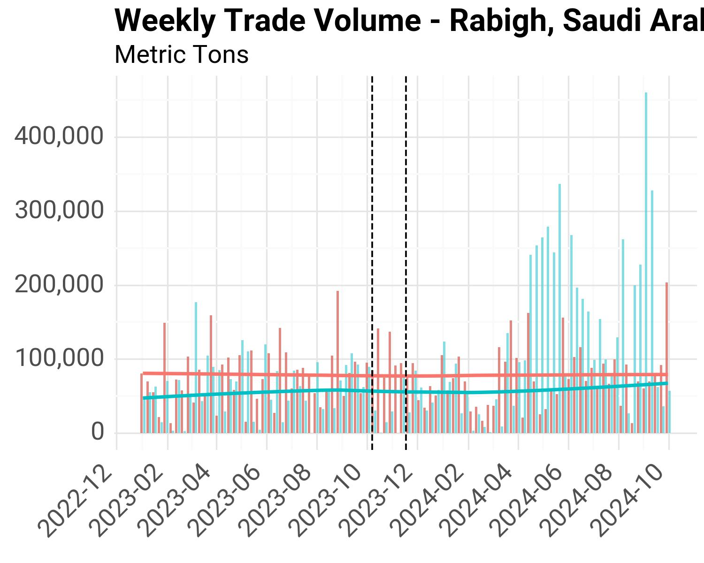
```
``` {tab-item} King Fahd Port

```
``` {tab-item} Duba

```
``` {tab-item} Yanbu

```
``` {tab-item} Jiddah
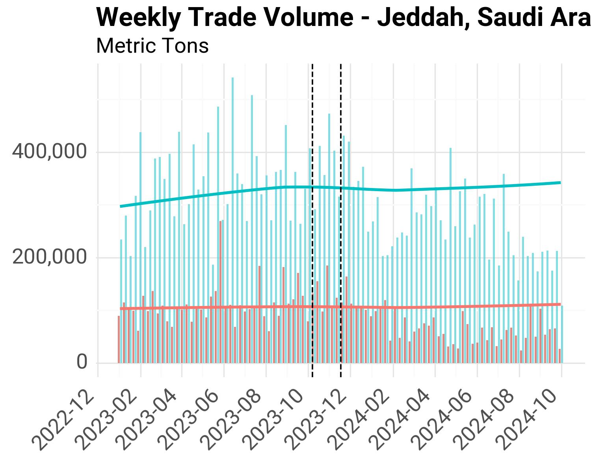
```
``` {tab-item} Jiddah Oil

```
````

#### Yemen

````{tab-set}
``` {tab-item} Al Mukalla
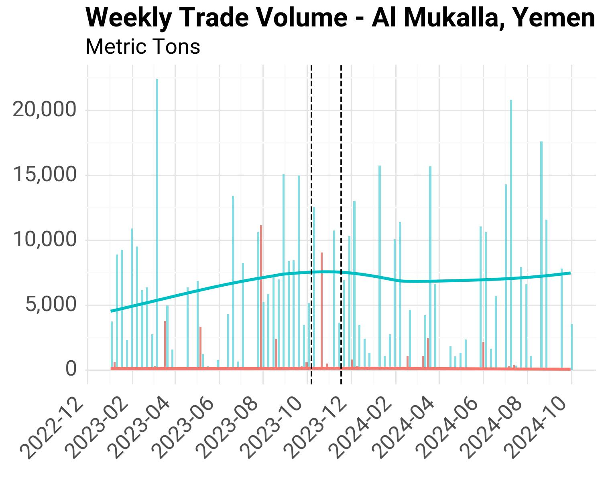
```
``` {tab-item} Al Ahmadi

```
``` {tab-item} Aden

```
````

## Methodology

Given the numerous weeks with no trade data in the PorWatch dataset, we resample the data to the monthly frequency using the sum value.

### Reference Period

We use the same reference period as in the choke points analysis: January 1st 2022 up to October 6th 2023. We calculate monthly historical averages based on this time period.

The following charts show trade volume for each port, separating imports and exports, and includes trend lines from the historical average data (blue for imports, red for exports).

#### Djibouti

````{tab-set}
``` {tab-item} Djibouti

```
````

#### Egypt

````{tab-set}
``` {tab-item} El-Adabiya
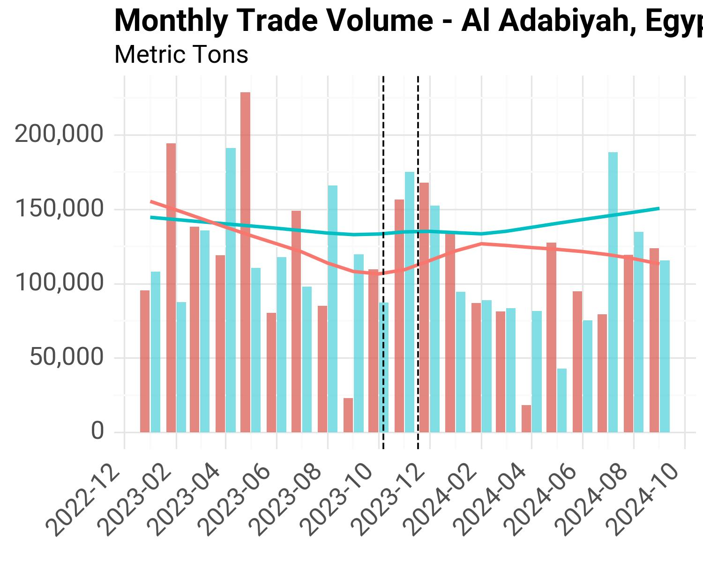
```
``` {tab-item} Safaga
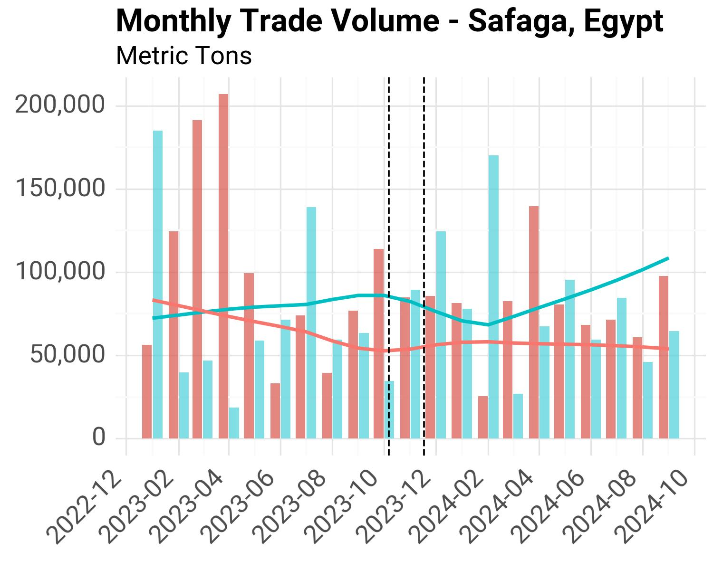
```
``` {tab-item} North Ain Sukhna Port
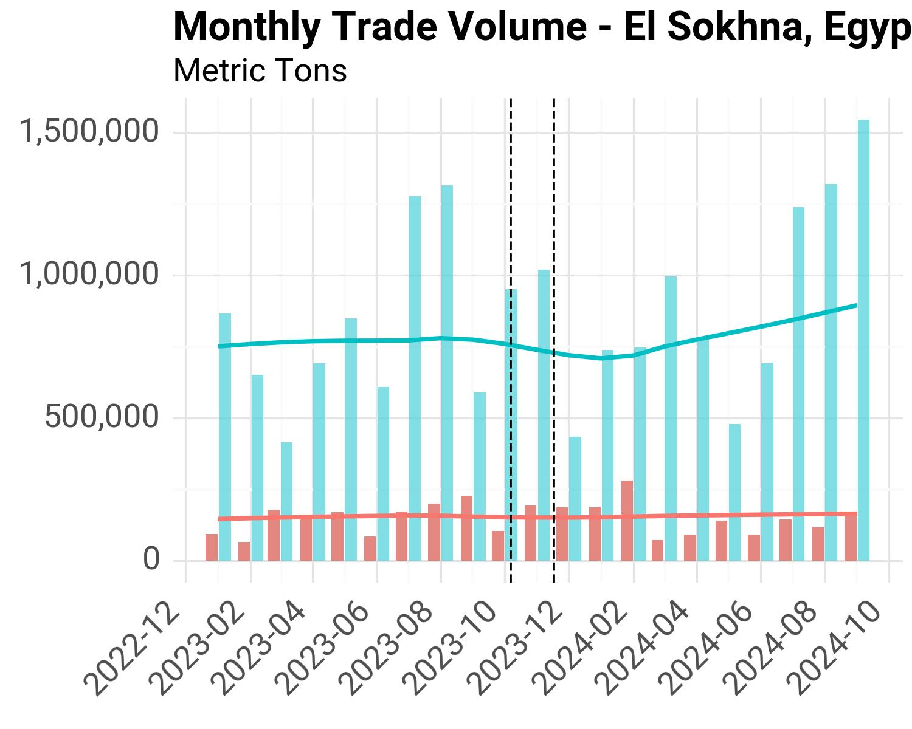
```
``` {tab-item} As Suways
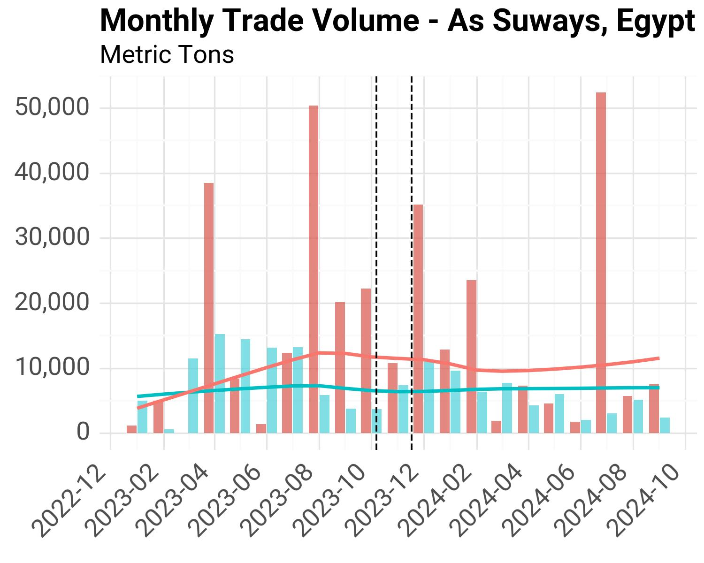
```
````

#### Jordan

````{tab-set}
``` {tab-item} Al Aqabah
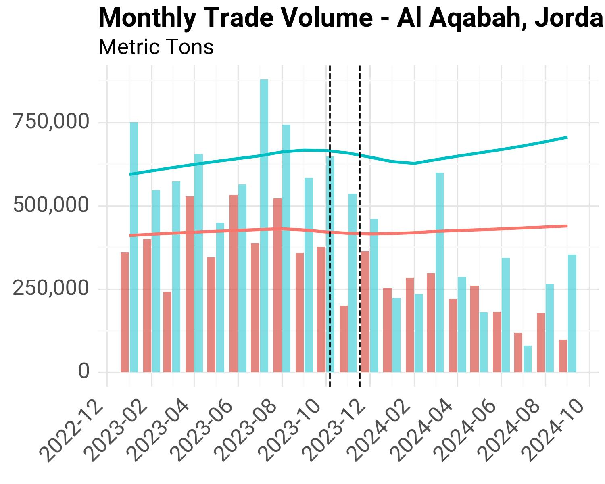
```
````

#### Saudi Arabia

````{tab-set}
``` {tab-item} Duba Bulk Plant Tanker Terminal

```
``` {tab-item} Rabigh
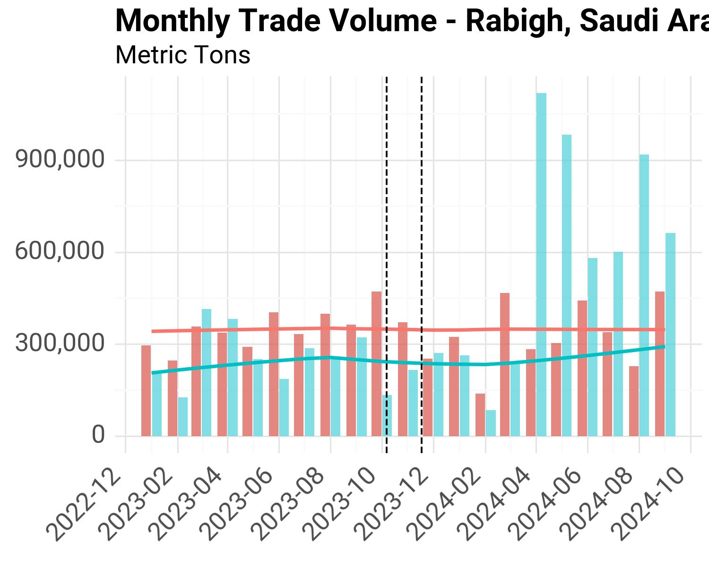
```
``` {tab-item} King Fahd Port
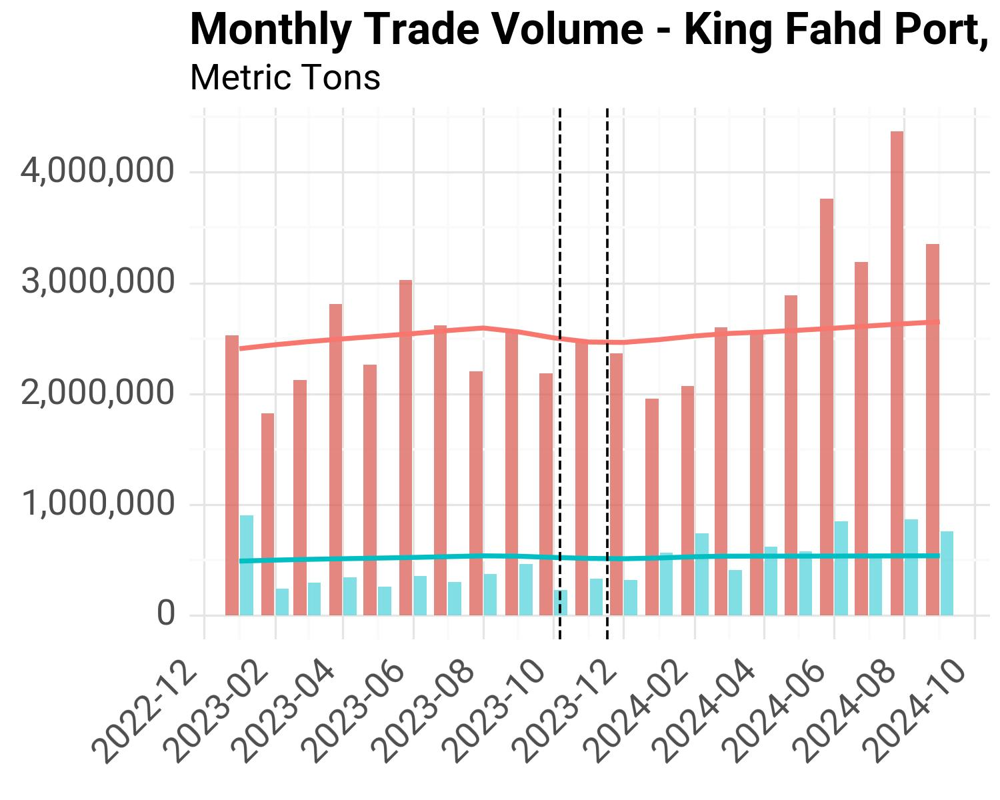
```
``` {tab-item} Duba
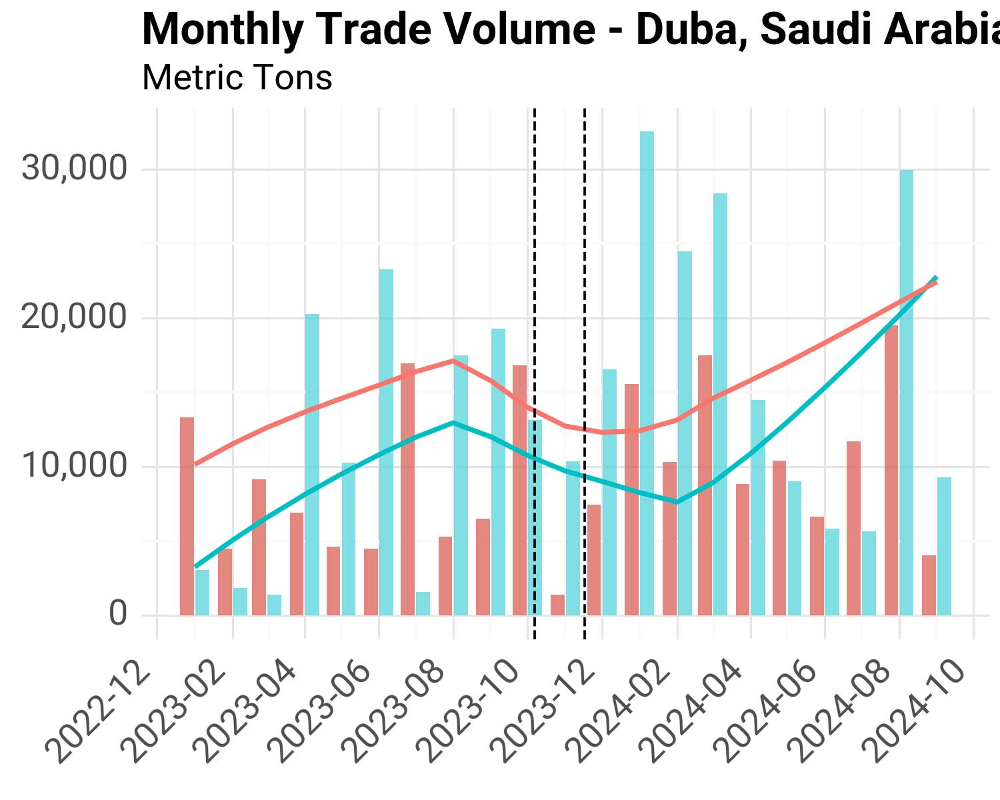
```
``` {tab-item} Yanbu

```
``` {tab-item} Jiddah

```
``` {tab-item} Jiddah Oil

```
````

#### Yemen

````{tab-set}
``` {tab-item} Al Mukalla

```
``` {tab-item} Al Ahmadi

```
``` {tab-item} Aden

```
````

## Summary Statistics

From this monthly data, we follow a similar methodology as the last section of the choke points analysis, and calculate monthly average values for each time period of interest.

- **Baseline**: January 1st, 2022 – October 6th, 2023
- **Middle East Conflict**: October 7th, 2023 - November 16th, 2023
- **Red Sea Crisis**: November 17th, 2023 - February 19th, 2024

The tables below are also accessible through the [Project's Sharepoint Folder](https://worldbankgroup.sharepoint.com/:x:/r/teams/DevelopmentDataPartnershipCommunity-WBGroup/Shared%20Documents/Projects/Data%20Lab/Red%20Sea%20Maritime%20Monitoring/tables/summary-tables-ports.xlsx?d=w6d7bf104d8c14016905e50ed1d50d4b8&csf=1&web=1&e=huaaYI).

### Monthly Averages by Time Period

| Country      | Port                            | Period               | Cargo Import   | Cargo Export   | Tanker Import   | Tanker Export   | Total Import   | Total Export   |
|:-------------|:--------------------------------|:---------------------|:---------------|:---------------|:----------------|:----------------|:---------------|:---------------|
| Djibouti     | Djibouti                        | Reference            | 496,248        | 36,378         | 158,454         | 12,919          | 654,701        | 49,297         |
| Djibouti     | Djibouti                        | Middle East Conflict | 506,081        | 49,468         | 120,205         | 4,083           | 626,285        | 53,550         |
| Djibouti     | Djibouti                        | Red Sea Crisis       | 401,003        | 77,485         | 139,392         | 17,145          | 540,395        | 94,630         |
| Egypt        | As Suways                       | Reference            | 4,648          | 5,132          | 783             | 1,127           | 5,430          | 6,259          |
| Egypt        | As Suways                       | Middle East Conflict | 5,706          | 0              | 0               | 0               | 5,706          | 0              |
| Egypt        | As Suways                       | Red Sea Crisis       | 7,646          | 2,240          | 0               | 10,066          | 7,646          | 12,305         |
| Egypt        | El-Adabiya                      | Reference            | 56,300         | 108,538        | 69,385          | 3,448           | 125,684        | 111,986        |
| Egypt        | El-Adabiya                      | Middle East Conflict | 63,403         | 151,135        | 83,762          | 0               | 147,165        | 151,135        |
| Egypt        | El-Adabiya                      | Red Sea Crisis       | 28,988         | 94,023         | 53,572          | 2,974           | 82,560         | 96,997         |
| Egypt        | North Ain Sukhna Port           | Reference            | 417,506        | 71,741         | 308,919         | 72,642          | 726,425        | 144,382        |
| Egypt        | North Ain Sukhna Port           | Middle East Conflict | 478,392        | 161,099        | 173,284         | 33,503          | 651,676        | 194,602        |
| Egypt        | North Ain Sukhna Port           | Red Sea Crisis       | 244,003        | 85,297         | 173,403         | 18,870          | 417,407        | 104,167        |
| Egypt        | Safaga                          | Reference            | 73,386         | 75,320         | 93              | 0               | 73,480         | 75,320         |
| Egypt        | Safaga                          | Middle East Conflict | 87,906         | 84,162         | 0               | 0               | 87,906         | 84,162         |
| Egypt        | Safaga                          | Red Sea Crisis       | 108,730        | 45,784         | 0               | 0               | 108,730        | 45,784         |
| Jordan       | Al Aqabah                       | Reference            | 505,767        | 392,247        | 120,238         | 34,849          | 626,004        | 427,096        |
| Jordan       | Al Aqabah                       | Middle East Conflict | 323,566        | 190,369        | 94,285          | 33,673          | 417,850        | 224,042        |
| Jordan       | Al Aqabah                       | Red Sea Crisis       | 211,418        | 183,203        | 33,706          | 12,891          | 245,124        | 196,094        |
| Saudi Arabia | Duba                            | Reference            | 11,470         | 12,741         | 0               | 0               | 11,470         | 12,741         |
| Saudi Arabia | Duba                            | Middle East Conflict | 9,502          | 0              | 0               | 0               | 9,502          | 0              |
| Saudi Arabia | Duba                            | Red Sea Crisis       | 17,484         | 9,306          | 0               | 0               | 17,484         | 9,306          |
| Saudi Arabia | Duba Bulk Plant Tanker Terminal | Reference            | 0              | 0              | 66,926          | 6,994           | 66,926         | 6,994          |
| Saudi Arabia | Duba Bulk Plant Tanker Terminal | Middle East Conflict | 0              | 0              | 24,267          | 0               | 24,267         | 0              |
| Saudi Arabia | Duba Bulk Plant Tanker Terminal | Red Sea Crisis       | 0              | 0              | 37,549          | 3,833           | 37,549         | 3,833          |
| Saudi Arabia | Jiddah                          | Reference            | 1,116,323      | 433,499        | 304,485         | 17,406          | 1,420,808      | 450,905        |
| Saudi Arabia | Jiddah                          | Middle East Conflict | 1,241,235      | 496,755        | 309,465         | 37,136          | 1,550,700      | 533,890        |
| Saudi Arabia | Jiddah                          | Red Sea Crisis       | 672,842        | 280,059        | 317,287         | 21,873          | 990,128        | 301,932        |
| Saudi Arabia | Jiddah Oil                      | Reference            | 0              | 0              | 336,104         | 4,674           | 336,104        | 4,674          |
| Saudi Arabia | Jiddah Oil                      | Middle East Conflict | 0              | 0              | 428,958         | 0               | 428,958        | 0              |
| Saudi Arabia | Jiddah Oil                      | Red Sea Crisis       | 0              | 0              | 213,399         | 29,017          | 213,399        | 29,017         |
| Saudi Arabia | King Fahd Port                  | Reference            | 72,768         | 134,102        | 486,407         | 1,929,692       | 559,175        | 2,063,794      |
| Saudi Arabia | King Fahd Port                  | Middle East Conflict | 44,789         | 104,329        | 249,356         | 1,865,661       | 294,144        | 1,969,990      |
| Saudi Arabia | King Fahd Port                  | Red Sea Crisis       | 71,688         | 99,701         | 230,213         | 1,328,270       | 301,901        | 1,427,971      |
| Saudi Arabia | Rabigh                          | Reference            | 515,971        | 384,649        | 219,304         | 305,019         | 735,276        | 689,669        |
| Saudi Arabia | Rabigh                          | Middle East Conflict | 443,722        | 364,038        | 165,869         | 353,272         | 609,591        | 717,310        |
| Saudi Arabia | Rabigh                          | Red Sea Crisis       | 163,975        | 154,983        | 171,208         | 178,847         | 335,183        | 333,830        |
| Saudi Arabia | Yanbu                           | Reference            | 127,704        | 76,367         | 9,543           | 346             | 137,247        | 76,713         |
| Saudi Arabia | Yanbu                           | Middle East Conflict | 89,140         | 20,167         | 8,558           | 0               | 97,699         | 20,167         |
| Saudi Arabia | Yanbu                           | Red Sea Crisis       | 53,960         | 34,242         | 9,699           | 0               | 63,660         | 34,242         |
| Yemen        | Aden                            | Reference            | 216,989        | 9,666          | 39,819          | 5,311           | 256,807        | 14,976         |
| Yemen        | Aden                            | Middle East Conflict | 163,033        | 3,116          | 28,444          | 1,143           | 191,477        | 4,259          |
| Yemen        | Aden                            | Red Sea Crisis       | 126,452        | 2,986          | 21,000          | 0               | 147,452        | 2,986          |
| Yemen        | Al Ahmadi                       | Reference            | 135,216        | 16,457         | 48,057          | 3,093           | 183,273        | 19,549         |
| Yemen        | Al Ahmadi                       | Middle East Conflict | 231,323        | 12,617         | 61,260          | 18,770          | 292,584        | 31,387         |
| Yemen        | Al Ahmadi                       | Red Sea Crisis       | 204,161        | 4,418          | 26,095          | 2,635           | 230,256        | 7,052          |
| Yemen        | Al Mukalla                      | Reference            | 18,541         | 3,350          | 7,391           | 1,223           | 25,932         | 4,574          |
| Yemen        | Al Mukalla                      | Middle East Conflict | 17,786         | 531            | 19,324          | 0               | 37,110         | 531            |
| Yemen        | Al Mukalla                      | Red Sea Crisis       | 6,605          | 0              | 9,136           | 0               | 15,741         | 0              |

### Monthly Averages by Time Period, % Change from Baseline

The following table shows the difference in monthly average values (% change from baseline period).

| Country      | Port                            | Period               | Cargo Import   | Cargo Export   | Tanker Import   | Tanker Export   | Total Import   | Total Export   |
|:-------------|:--------------------------------|:---------------------|:---------------|:---------------|:----------------|:----------------|:---------------|:---------------|
| Yemen        | Aden                            | Middle East Conflict | -24.87%        | -67.76%        | -28.57%         | -78.48%         | -25.44%        | -71.56%        |
| Yemen        | Aden                            | Red Sea Crisis       | -41.72%        | -69.11%        | -47.26%         | -100.00%        | -42.58%        | -80.06%        |
| Yemen        | Al Ahmadi                       | Middle East Conflict | 71.08%         | -23.33%        | 27.47%          | 506.90%         | 59.64%         | 60.55%         |
| Yemen        | Al Ahmadi                       | Red Sea Crisis       | 50.99%         | -73.16%        | -45.70%         | -14.81%         | 25.64%         | -63.93%        |
| Yemen        | Al Mukalla                      | Middle East Conflict | -4.07%         | -84.15%        | 161.44%         | -100.00%        | 43.10%         | -88.39%        |
| Yemen        | Al Mukalla                      | Red Sea Crisis       | -64.38%        | -100.00%       | 23.61%          | -100.00%        | -39.30%        | -100.00%       |
| Jordan       | Al Aqabah                       | Middle East Conflict | -36.02%        | -51.47%        | -21.58%         | -3.37%          | -33.25%        | -47.54%        |
| Jordan       | Al Aqabah                       | Red Sea Crisis       | -58.20%        | -53.29%        | -71.97%         | -63.01%         | -60.84%        | -54.09%        |
| Egypt        | As Suways                       | Middle East Conflict | 22.77%         | -100.00%       | -100.00%        | -100.00%        | 5.08%          | -100.00%       |
| Egypt        | As Suways                       | Red Sea Crisis       | 64.50%         | -56.36%        | -100.00%        | 793.46%         | 40.80%         | 96.61%         |
| Egypt        | El-Adabiya                      | Middle East Conflict | 12.62%         | 39.25%         | 20.72%          | -100.00%        | 17.09%         | 34.96%         |
| Egypt        | El-Adabiya                      | Red Sea Crisis       | -48.51%        | -13.37%        | -22.79%         | -13.74%         | -34.31%        | -13.38%        |
| Egypt        | North Ain Sukhna Port           | Middle East Conflict | 14.58%         | 124.56%        | -43.91%         | -53.88%         | -10.29%        | 34.78%         |
| Egypt        | North Ain Sukhna Port           | Red Sea Crisis       | -41.56%        | 18.90%         | -43.87%         | -74.02%         | -42.54%        | -27.85%        |
| Egypt        | Safaga                          | Middle East Conflict | 19.79%         | 11.74%         | -100.00%        | nan%            | 19.63%         | 11.74%         |
| Egypt        | Safaga                          | Red Sea Crisis       | 48.16%         | -39.21%        | -100.00%        | nan%            | 47.97%         | -39.21%        |
| Djibouti     | Djibouti                        | Middle East Conflict | 1.98%          | 35.98%         | -24.14%         | -68.40%         | -4.34%         | 8.63%          |
| Djibouti     | Djibouti                        | Red Sea Crisis       | -19.19%        | 113.00%        | -12.03%         | 32.71%          | -17.46%        | 91.96%         |
| Saudi Arabia | Duba                            | Middle East Conflict | -17.15%        | -100.00%       | nan%            | nan%            | -17.15%        | -100.00%       |
| Saudi Arabia | Duba                            | Red Sea Crisis       | 52.44%         | -26.96%        | nan%            | nan%            | 52.44%         | -26.96%        |
| Saudi Arabia | Duba Bulk Plant Tanker Terminal | Middle East Conflict | nan%           | nan%           | -63.74%         | -100.00%        | -63.74%        | -100.00%       |
| Saudi Arabia | Duba Bulk Plant Tanker Terminal | Red Sea Crisis       | nan%           | nan%           | -43.89%         | -45.20%         | -43.89%        | -45.20%        |
| Saudi Arabia | Jiddah                          | Middle East Conflict | 11.19%         | 14.59%         | 1.64%           | 113.36%         | 9.14%          | 18.40%         |
| Saudi Arabia | Jiddah                          | Red Sea Crisis       | -39.73%        | -35.40%        | 4.20%           | 25.67%          | -30.31%        | -33.04%        |
| Saudi Arabia | Jiddah Oil                      | Middle East Conflict | nan%           | nan%           | 27.63%          | -100.00%        | 27.63%         | -100.00%       |
| Saudi Arabia | Jiddah Oil                      | Red Sea Crisis       | nan%           | nan%           | -36.51%         | 520.83%         | -36.51%        | 520.83%        |
| Saudi Arabia | King Fahd Port                  | Middle East Conflict | -38.45%        | -22.20%        | -48.74%         | -3.32%          | -47.40%        | -4.55%         |
| Saudi Arabia | King Fahd Port                  | Red Sea Crisis       | -1.48%         | -25.65%        | -52.67%         | -31.17%         | -46.01%        | -30.81%        |
| Saudi Arabia | Rabigh                          | Middle East Conflict | -14.00%        | -5.36%         | -24.37%         | 15.82%          | -17.09%        | 4.01%          |
| Saudi Arabia | Rabigh                          | Red Sea Crisis       | -68.22%        | -59.71%        | -21.93%         | -41.37%         | -54.41%        | -51.60%        |
| Saudi Arabia | Yanbu                           | Middle East Conflict | -30.20%        | -73.59%        | -10.32%         | -100.00%        | -28.82%        | -73.71%        |
| Saudi Arabia | Yanbu                           | Red Sea Crisis       | -57.75%        | -55.16%        | 1.64%           | -100.00%        | -53.62%        | -55.36%        |

## Implementation

- [Notebook to create charts and tables](red-sea-ports.ipynb)
